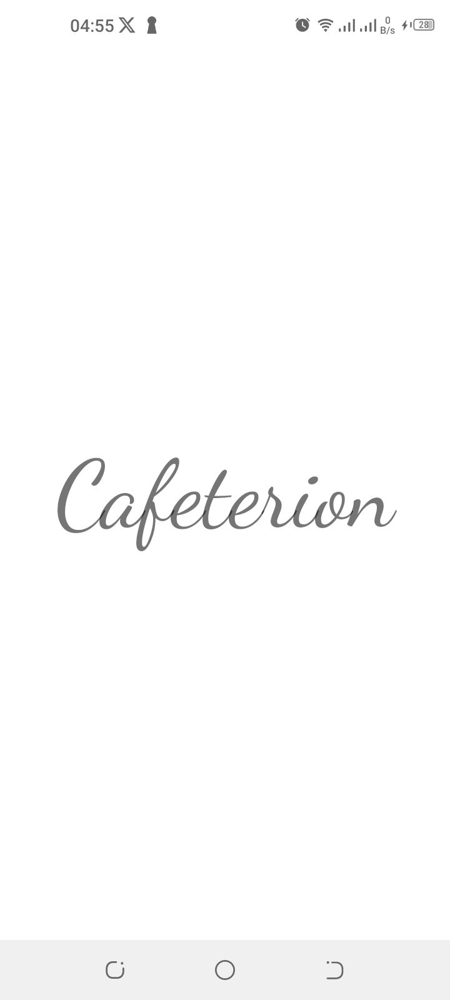
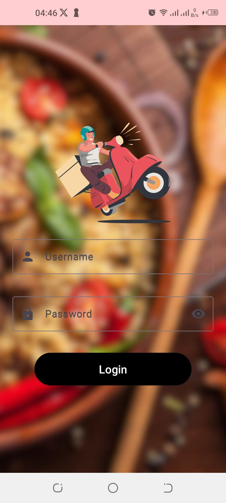
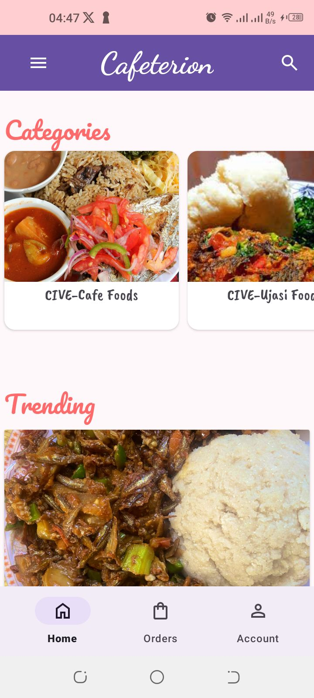
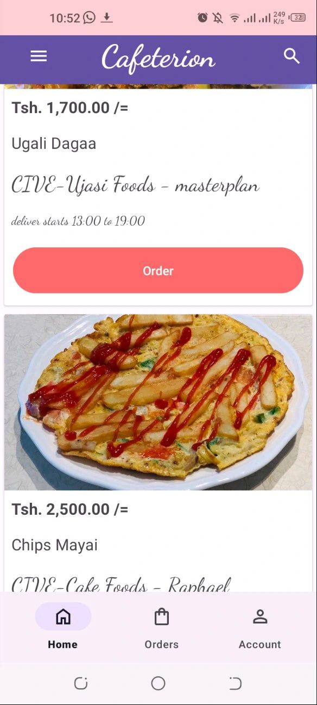
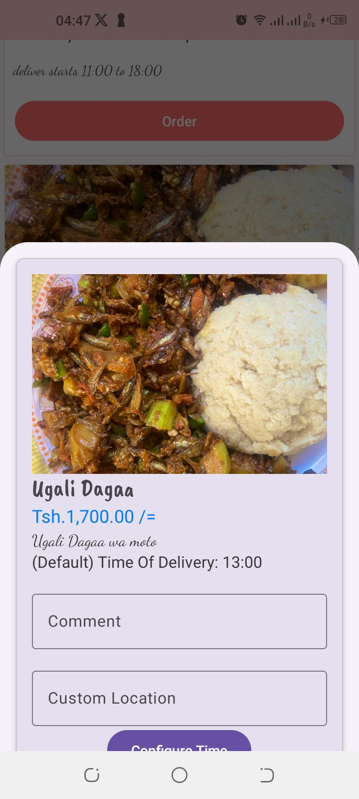

# cafeterion-customers-app 


<p align="left">  </p>

Welcome to Cafeterion, a mobile application built with Kotlin to simplify the food ordering process within university campuses.

*Remember: The owner's edition is [here](https://github.com/isaka-james/cafe-owner-android-application).For full expirience one should use [customer app](https://github.com/isaka-james/cafeterion-customers-app), [cafe deliver app/cafe's owner](https://github.com/isaka-james/cafe-owner-android-application) and [cafeterion server](https://github.com/isaka-james/) for full experience and performance.*

## Features

- **User Authentication:** Securely manage user accounts for a personalized experience.
- **Menu Exploration:** Browse a diverse selection of food items available within the university.
- **Order Placement:** Effortlessly place orders through an intuitive and user-friendly interface.
- **Customization:** Tailor your orders to meet personal preferences or dietary requirements.
- **Order Tracking:** Stay updated with real-time status notifications for your placed orders.
- **Notification System:** Receive timely alerts for order confirmations and updates.

### Prerequisites

Make sure you have the following installed:

- [Android Studio](https://developer.android.com/studio)

### Installation

1. Clone the repository:

   ```bash
   git clone https://github.com/isaka-james/cafeterion-customers-app.git
   ```
   
2. Open the project in Android Studio and build the application.


## App Functionality

The app is fully operational, providing a smooth user experience. Please note that to use the Cafeterion app, you need to connect to the Cafeterion server, which is hosted at [isaka-james's GitHub repository](https://github.com/isaka-james). Follow these steps to ensure proper functionality:

1. **Launch the Cafeterion Server:**
   - Visit [https://github.com/isaka-james](https://github.com/isaka-james).
   - Locate the Cafeterion server repository and follow the provided instructions to launch the server.

2. **Locate Username and Password:**
   - To access the Cafeterion app, find the username and password in the server files or database on the server.
   - Navigate to the server repository and check relevant configuration files or database entries.

3. **Modify Server Endpoint in Cafeterion App:**
   - Once the server is up and running, open the Cafeterion app.
   - Navigate to the settings or configuration section within the app.
   - Find the server endpoint configuration and update it to match the address where you launched the Cafeterion server.

Now, you're ready to enjoy the full features of Cafeterion! If you encounter any issues or need assistance with the username and password, refer to the server files or database on the server.


## Sample Screenshots

<div style="margin: 50px">

The splash screen of the cafeterion customers app
</div>

<div style="margin: 50px">

The login form of the cafeterion customers app
</div>

<div style="margin: 50px">

The homepage of the cafeterion customers app showing the categories
</div>

<div style="margin: 50px">

The homepage showing the trending and recently foods ordered
</div>

<div style="margin: 50px">

The place for placing orders
</div>

## Notice
The project was made from Stratch.

## License
This project is licensed under the [MIT License](LICENSE.md). 
